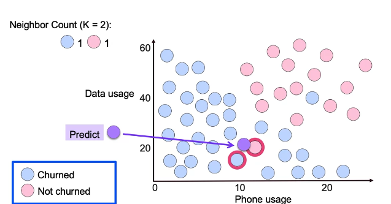

## Classification

## Logistic Regression

Performs binary classification, defined as:

$p(X) = \frac{e^{\beta_0 + \beta_1X}}{1 + e^{\beta_0 + \beta_1X}} = \frac{1}{1 - e^{\beta_0 + \beta_1X}}$

and optimizes for the correct value through maximum likelihood.

For binary data, logistic regression is able to better capture the probability of a given $X$ belonging to $1$ or $0$, based on a rounded probability value based on a threshold.

The odds of a given $X$ are computed as:

$\frac{P(X)}{1 - P(X)}$

where then that is equivalent to $e^{\beta_0 + \beta_1 X}$

$\frac{P(X)}{1 - P(X)} = e^{\beta_0 + \beta_1 X}$

$logit = log(\frac{P(X)}{1 - P(X)}) = \beta_0 + \beta_1 X$

This is also known as the logit.

This logit is then used in the logistic function as:

$p(logit) = \frac{1}{1 - e^{logit}}$

Where an increase in an $X_i$ by a given unit $n$ will increase the $logit$ by a factor of $n * \beta_i$ or increases the regular odds by a factor of $e^{\beta_i}$.

While the increase in the $logit$ might appear to be linear, the characteristic of the logistic sigmoid function as $\frac{1}{1 - e^{z}}$ makes the increase in the output probability proprotionally non-linear to the input $logit$. The rate of change to the current $p(X)$ depends on the current value of $X$ as the sigmoid function is in an $S$-shaped curve.

Interpreting this can be useful for understanding how the input features of a model change a specific outcome.

Non-linear models, as linear regression, can then be modeled through a *likelihood function*, where the coefficients $\beta_0$ and $\beta_1$ are chosen to maximize the likelihood function.

### Multiple Logistic Regresion

Posits the same process as logistic regression with the addition of multiple feature $X$.

$p(X) = \frac{e^{\beta_0 + \beta_1X_1 + ... + \beta_nX_n}}{1 + e^{\beta_0 + \beta_1X_1 ... + \beta_nX_n}} = \frac{1}{1 - e^{\beta_0 + \beta_1X_1 + ... + \beta_nX_n}}$

### Multinomial Logistic Regression

An extension of the logistic regression function, also can be known as softmax regression,

You can train different models for each $K$ class as:

$Pr(Y = k \mid X = x) = \frac{e^{\beta_{k0} + \beta_{k1} x_1 + \ldots + \beta_{kp} x_p}}{1 + \sum_{l=1}^{K-1} e^{\beta_{l0} + \beta_{l1} x_1 + \ldots + \beta_{lp} x_p}}$

where the numerator is the total probabiity over all classes and the denominator is the probabiity for class $k$.

This then computes the probabiity of a $k$ belonging in $K$

Then you can compute the probability for a chosen reference class $K$ as:

$Pr(Y= K | X = x) = \frac{1}{1 + \sum e^{Z}}$

Then, the log odds of $k$ belonging in $K$ is defined as:

$log(\frac{Pr(Y =k|X=x)}{Pr(Y = K | X = x)})=βk_0+βk_1x_1+···+β_{kp}x_p$

In essence, the log odds is transformed into a probability through the logistic sigmoid function.

Note that the reference class is purely used to compute the log odds of $k$ compared to $K$.

The result, whether we choose another class $k$ to be $K$, of the log odds will the same no matter which $K$. 

The difference is that in when optimizing for model interpretation, the coefficients $\beta$ will differ in value, choosing different $K$ so one must be careful when interpreting the model.

### K-Nearest-Neighbors

A K-Nearest Neighbor Clasifier aims to classify a datapoint $X$ by taking a look at the labels of the nearest $K$ datapoints, to take the probability of $X$ belonging to a class $Y$.

 

 

Mathematically, can be defined as:

$Pr(Y = j | X = x_0) = \frac{1}{K} \sum_{i∈N_k} I(y_i = j)$

Where we choose the $K$ nearest neighbors, then compute through $I(y_i = j)$ the probability that a given $x_0$ belongs to a class $Y$ and average it over $K$.  

This is computed multiple times for all $j$ classes to properly estimate the probability of $x_0$ belonging to the set of $j$ classes.

This is done by comparing the amount of nearest classes to a given $x_0$. The class that has the highest amount of datapoints near to $x_0$ is then chosen as the prediction class that $x_0$ might belong to.

The KNN then classifies the test observation $x_0$ to the class with the highest probability.

If there happens to be a tie between the number of datapoints nearest to $x_0$ amongst seperate classes, an odd number $K$ can be chosen which breaks a tie in terms of binary classification, but in multi-class classification, the point that's closest to $x_0$, computed per the $L_2$ norm, can be chosen as the class which $x_0$ belongs to. 

Note that the choice of $K$ can determine if the model overfits the training set or not. 

When $K$ is a small value, the KNN is less rigid and more flexible, thereby being unable to generalize to real data, as it has more variance.

When $K$ is a large value, the KNN is more rigid and less flexible, thereby having a higher bias. 

The ***pro*** of choosing KNN as a model is it's simple to implement, adapts well to new training data, and is easy to interpret.

The ***cons*** can include

- Slow prediction, due to many distance calculations
- Generating insights into the data can be difficult as you have no parameters that tell you how much of a certain feature in $x_0$ contribute to the output $Y$ 
- Suffering from the curse of dimensionality. When adding extra dimensions to features, they tend to disproportionately skew in terms of distance. This can decorrelate a given data point form another despite belonging within the same class.

Applications have included 
- Automated web usage data mining and reocmmendation systems -- A KNN takes the web usage of a user and then builds a recommendation system using a KNN.

 
 Other notes

To implement the kd-tree,

We have to take a column of the dataset and take the median. Then we split in half based on the median. Anything lower than the median goes in one group anything higher goes into the other. This is done for each available segment until we reach a minimum which is denoted by the leaf size.

