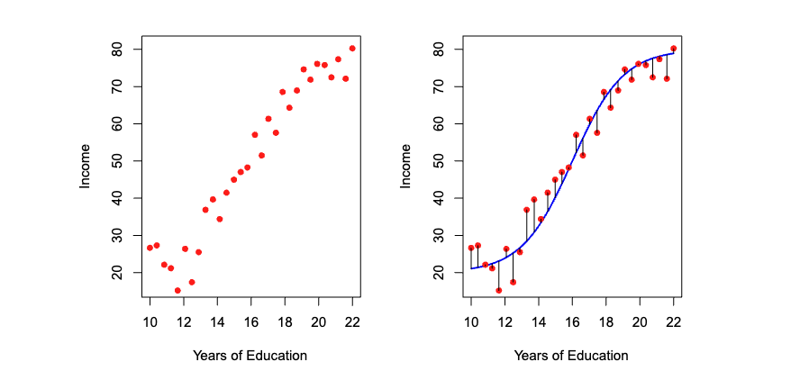
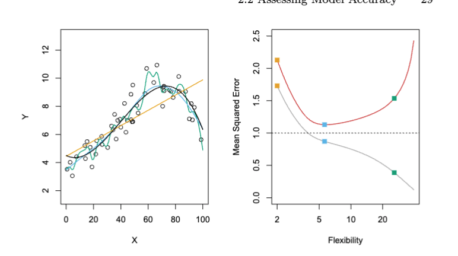

# Introduction to Statistical Learning

## **2.1 What is Statistical Learning**

- Inputs are typically denoted as independent variables.
- Outputs are typically denoted as dependent variables.

If there is a response $Y$, from a set of $X_p$ as, $X_1, X_2, ... ,X_p$, there can be a relationship mapped between $Y$ and $X_p$, denoted as $Y = f(X) + \epsilon$, where $\epsilon$ is an error term (irreducible error) and $f(X)$ is some fixed function of $X$,

> *The error term, is then the unexplained variation or residual of the set of datapoints.*

$f$ then represents the information that $X$ yields about $Y$, as it captures the relationship or pattern between the former and the latter.

</img>

 

> *$\epsilon$ can be denoted, by the vertical blue lines, aka residuals.*

### 2.1.1 Why Estimate $f$?

There are 2 main reasons to estimate $f$, *prediction* and *inference*.

#### **Prediction, Reducble and Irreducible Error**

In a model denoted as $\hat{Y} = \hat{f}(X)$, reducible error is the error that one can reduce by improving the accuracy of $\hat{f}$.

Then, in a model, $\hat{Y} = \hat{f}(X)$, if one were able to perfectly map $\hat{f}$ to $\hat{Y}$, as $f(X)$ by minimizing the reducible error, there will still be some degree of error as the function to estimate $Y$ always includes some residual $\epsilon$. 

> $Y = f(X) + \epsilon$

This type of error is known as irreducible error, where it cannot be reduce through continuing to improve the accuracy of function $\hat{f}$ or $f$.

This comes about as a result of inherent variability in the $Y$, through $\epsilon$, not captured by the input variables $X$.

Factors include, immeasurable variation:

- The manufacturing of a drug given to a patient, the patient's general mental wellbeing, etc. 

Considering the expected value of the squared residual as, $E(Y - \hat Y)^2$, oen can denote this residual as:

$E[(f(X) + \epsilon) - \hat{f}(X)]^2$

where $(f(X) - \hat{f}(X))^2$ is reducible and $Var(\epsilon)$ is irreducble.

The goal then, for better *prediction* by minimizing the squared residual, is to minimize the reducible error through improving $\hat f$ and perhaps minimizing the "irreducible" error through better data collection.

#### Inference and Association

If the goal is to understand the relationships between $Y$ and $X_p$ (inference), the estimate of $\hat{f}$ cannot be treated a black box. 

You need to understand the exact form of $\hat{f}$ through asking and then identifying:

- *Which parameters ( $X$ ) are associated with the repsonse?*
- *What is the relationship between the associated parameters $X$ and the response*

    Some parameters $X$ may increase as $Y$ increases (postive relationship) while inversely may decrease (negative relationship).

- *Can the relationship between $X$ be summarized linearly, or more complicated, non-linearly?*

Linear and non-linear models can both be extremely useful for estiamting $f$, the former being more interpretable while the latter being less interpretable with perhaps more accuracy.

### 2.1.2 How Do We Estimate $f$?

- $X$ -- referred to as *training data*

Let $x_{ij}$ be the $jth$ feature in the $ith$ sample / observation. 

Let $y_i$ be the response variable (output) for the $ith$ obvervarion / sample.

Goal is top find a function $\hat f$, that can reliable estimate $y_i$ from $x_i$ using $x_{ij}$.

There are 2 means, 

- Parameteric
- Non-Parametric

#### Parametric

The means to estimate $f$ by iteratively selecting a set of parameters, $\theta$. 

Involve 2-steps,

First is making an assumption of the adequate form of $f$ to model $Y$. A straightforward assumption is that $f$ is a linear model / function of $X$.

$f(X) = \theta_0 + X_1\theta_1 + X_2\theta_2 + ... + X_p\theta_p$

Now that there's a foundational basis for the estimation of $f$, one only needs to estimate $p+1$ parameters $\theta$ ( including a bias or intercept term, $\theta_0$ ).

Second is to construct a procedure and use such procedure to *fit* or *train* the model by iteratively adjusting $\theta$ to more accurately model $Y$ through $f$.

Find values of $\theta$ such that, $Y ≈ \theta_0 + X_1\theta_1 + X_2\theta_2 + ... + X_p\theta_p$.

In linear models, this is typically done through *ordinary least squares*.

> *Though, can be estimated through other means such as gradient descent*

Some issues that arise with these models is that they won't match the true form of $f$, as it's structure is parametric and thereby it's adequate form is bounded and pre-defined.

This can be mitigated via increasing the number of parameters, but then one risks overfitting to the training dataset.

#### Non-Parametric

These, unlike Parametric Methods, don't make explicit assumptions about the form of $f$. 

By doing so, they can have the advantage to fit a wider range of possible shapes of $f$, avoiding the danger of not being able to estimate the true $f$ from it's functional basis provided through a parametric method.

But they typically require large amounts of samples / observations to accurately estimate $f$. 

This then may risk overfitting if not intentional of mitigating it.

Some examples include KNNs, SVMs, & random forests.

### 2.1.3  The Trade-Off Between Prediction Accuracy and Model Interpretability

Restrictive models, such as linear regression, is more inflexible. It can only generate linear $f$'s and therefore may be more innacurrate when modelling real data, depending the data's degree of non-linearity.

Being inflexible can improve it's interpretation, at the risk of losing out on accuracy.

Flexible models, which often are non-linear, tend to be more accurate but then are less interpretable.

- SVMs
- Neural NEtworks
- Bagging
- Boosting

When inference is the goal, providing $\hat f$ as a black box isn't ideal therefore a more inflexible model might be chosen as they're more interpretable.

When prediction is the goal, $\hat f$, may be a black box in order to optimze for prediction, therefore more flexible and less interpretable models that yield a higher accuracy may be chosen.

### 2.1.4 Supervised v Unsupervised

Supervised learning is where a model is given a strict set of samples $X_p$ corresponding to a set of labels or true outputs $Y_p$. 

Unsuperivsed learning is where a model is given purely a set of samples $X_p$ with no labels or true outcomes.

Here then, we can seek to understand the underlying relationships between the observations. This can be done through *clustering / cluster analysis*, where one clusters datapoints with similar attributes into seperate clusters.

Semi-supervised is where one leverages both, labeled and unlabeled datapoints to maximize the accuracy of modelling $Y$ through $\hat {f}$

## 2.2 Assessing Model Accuracy

- There are many means to estimate $Y$, there is no one single best method. Finding the most suitable is more of an empirical process on the current task -- it's context dependent, no free-lunch.

### 2.2.1 Measuring Quality of Fit.

There must be a way to evaluate the performance of a model (statistical learning method)

The most common means to do so in regression is the *mean squared error*,

$MSE = \frac{1}{n}\sum_{i = 1}^{n} (Y - \hat{f}(X))^2$

where MSE is smaller when the predictions of $\hat{f}$ are more accurate to true labels $Y$.

Error values as such can be used during training but the true value comes from maximizing the the performance during testing, on unseen data.

Aiming to minimize the $MSE$ on pure training data can be fallible, there is no guarantee that your model won't overfit.

The more flexible your model is, the more likely it will decrease the $MSE$, as it has a higher degree of freedom.

The inverse is true, where less-flexibility can increase the $MSE$

Decreasing the training $MSE$ then comes at the risk of increeasing the testing $MSE$, indicating overfitting.

</img>

 

Hence, as model flexiblity increases, training $MSE$ decreases but test $MSE$ may increase.

The inverse is true as flexiblity decreases, until a certain point where both begin to decrease due to inaccurate estimations.

> There are some means to mitigate overfitting while still retaining flexbility. In neural networks, you can introduce regularization such as L1, L2, and dropout.

### 2.2.2 Bias & Variance

- To best construct a model that properly estimates on test data, we need to construct a model with low *variance* and low *bias*.

Low Variance -- Minimize the amount that $\hat f$ would change if estimated with different sets of datapoints. Make sure the loss / accuracy values of $\hat f$ don't differ per training and testing data.

Low Bias -- found by minimizing the reducible error introduced by approximating a real worald problem. Linear reg ression has as higher bias, a more flexible model would have a decreased bias.

### 2.2.3 The Classification Setting

#### Bayes Classifier

The test error rate, given by $\frac{1}{n}\sum(y_i≠\hat y_i)$, can be minimized by a classifier that assigns a given observation / sample to the most likely class based on its predictor values, which comprise the whole of $x_0$.

We could then assign an observastion / sample to a class $j$ for which the probability is largest.

$Pr(Y = j | X = x_0)$ 
 Probability that the true class label $Y$ is equivalent to a class $j$, given a sample $x_0$

This is called a *bayes classifier*.

 
Example

To find a predicted class, we'd compute the above probability for all classes $j$ and then take the maximal probability for the given class to identify the predicted class.

The error rate for a given class can then be computed as the difference 1 and the $max$ value of the above computation:

$1 - max(Pr(Y = j | X = x_o))$

This essentially denotes the confidence that the model has of a given $x_0$ belonging to a given class that holds the maximum probability.

If the value is near $1$, the confidence is minimal, while if the value is near $0$, the confidence is maximal. 

Once this theoretical model is trained, the remaining value can be equivalent to the irreducible error within the given task.

> *In practice, if using Softmax for instance, this would be simply computed by taking the max of the output activation and substracting from 1.*

The bayes classifier assumes that we can accurately compute the probability of $Y = j$ given an observation $X$ through a function $f$.

The bayes classifier is the gold standard of which to measure towards, but we don't have knowledge of a function $f$ that maps $X$ to $Y$ prior and therefore computing the bayes classifier from the beginning is impossible, given that we can't compute the accurate probability that $Y = j$ without knowledge of a function $f$.

Ideally, through training a model, we aim to reach as equivalent perforamnce as a bayes classifier would be ( barring the irreducble error ).

> *Total error can then be computed as the $\sum bias^2$ + $Var$ + Bayes Error*

#### K-Nearest Neighbors

Given that computing such a classifier is impossible, we can estimate the distribution of $Y$ g iven $X$ and then classify an unknown observation to the class with the highest probability.

*K-Nearest Neighbors* does such a task.

$Pr(Y = j | X = x_0) = \frac{1}{K} \sum_{i∈N_k} I(y_i = j)$

Where we choose the $K$ nearest neighbors, then compute through $I(y_i = j)$ the probability that a given $x_0$ belongs to a class $Y$ and average it over $K$.  

This is computed multiple times for all $j$ classes to properly estimate the probability of $x_0$ belonging to the set of $j$ classes.

The KNN then classifies the test observation $x_0$ to the class with the highest probability.

The choice of $K$ can determine if the model overfits the training set or not. 

When $K$ is a small value, the KNN is less rigid and more flexible, thereby being unable to generalize to real data, as it has more variance.

When $K$ is a large value, the KNN is more rigid and less flexible, thereby having a higher bias. 

