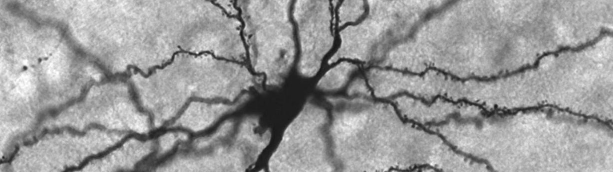

</img>

# grokking machine-learning

Curr. I'm working on understanding as much as I can on machine learning, to build a foundation for getting into deep learning algs + research.

Here, I'll iteratively update this repo of code implementations and notes.

Eventually, this will turn into a full guide, as was done with the previous shipped [awesome-neural-networks](https://github.com/vxnuaj/awesome-neural-networks)

1. [Regression](01-regression)
2. [Classification](02-classification)
3. [Other](other)
